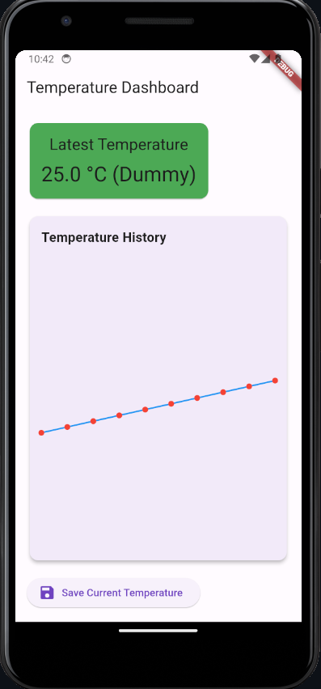

# Thermal Tracker

Thermal Tracker é um aplicativo Flutter desenvolvido para monitorar temperaturas em tempo real, utilizando um sensor conectado a um Raspberry Pi e integrando os dados com a plataforma ThingSpeak. O aplicativo exibe as temperaturas mais recentes, um histórico em formato de gráfico e permite salvar os dados localmente.

---

## Funcionalidades

- **Monitoramento em tempo real**: Exibe a temperatura mais recente capturada pelo sensor.
- **Histórico de temperaturas**: Apresenta um gráfico com as leituras anteriores.
- **Alertas visuais**: Indica temperaturas fora da faixa ideal com cores (verde para normal, vermelho para alta).
- **Salvamento de dados**: Permite salvar a temperatura atual para consulta futura.

---

## Requisitos

### Hardware
- Raspberry Pi Pico 2 com sensor de temperatura integrado.
- Conexão com a internet para envio de dados à plataforma ThingSpeak.

### Software
- Flutter SDK (versão estável mais recente).
- Dependência: `http` para consumo da API externa.

---

## Configuração do Projeto

1. **Clone o repositório**:
   ```bash
   git clone https://github.com/seu-usuario/thermal_tracker.git
   cd thermal_tracker
   ```

2. **Instale as dependências**:
   ```bash
   flutter pub get
   ```

3. **Configure a API**:
   - Substitua `YOUR_CHANNEL_ID` e `YOUR_API_KEY` no arquivo `api_service.dart` com as credenciais do seu canal ThingSpeak.

4. **Execute o aplicativo**:
   ```bash
   flutter run
   ```

---

## Estrutura do Projeto

- **lib/main.dart**: Ponto de entrada do aplicativo.
- **lib/screens/dashboard_screen.dart**: Tela principal do aplicativo, incluindo o gráfico e o layout do dashboard.
- **lib/services/api_service.dart**: Serviço responsável por consumir a API do ThingSpeak.
- **lib/widgets/temperature_card.dart**: Widget reutilizável para exibir informações de temperatura.

---

## Captura de Tela

Adicione aqui uma captura de tela do aplicativo em execução:




## Licença

Este projeto está licenciado sob a [MIT License](LICENSE).

---

## Referências

- [Documentação do Flutter](https://docs.flutter.dev/)
- [ThingSpeak API](https://thingspeak.com/docs)
